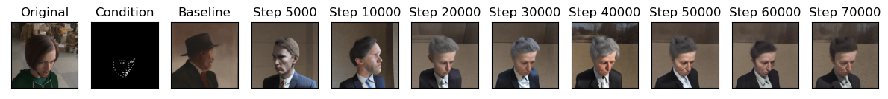
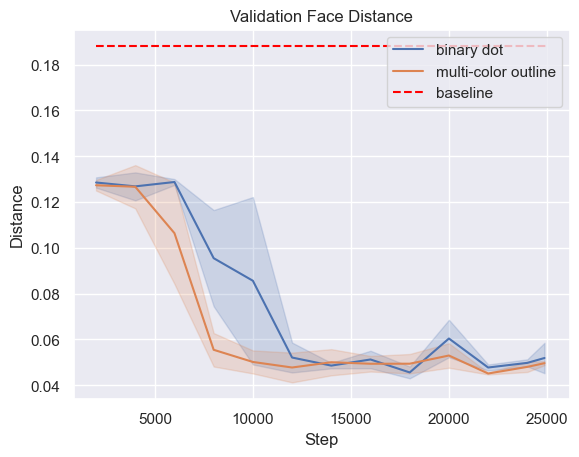
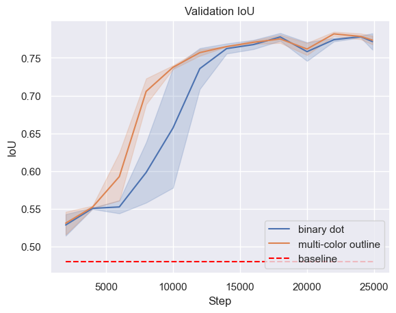
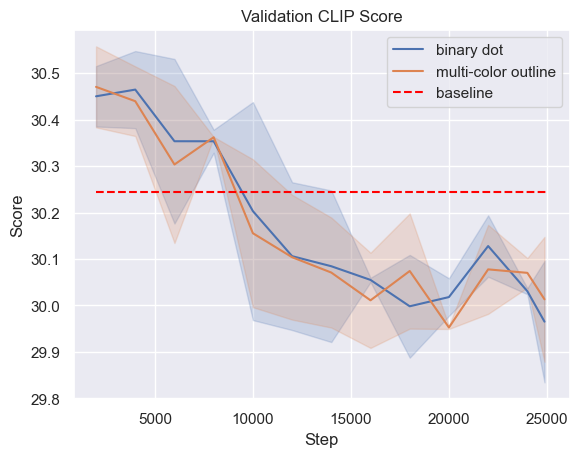

# Face Control - Facial Editing using ControlNet

This project allows generating any faces you want by specifying facial landmarks and text prompt.

A detailed project report can be found [here](https://drive.google.com/file/d/1gzjCfk4g5xG8soqMQbqwqMBgeDMUrJ8j/view?usp=sharing)

The project mainly uses the huggingface tech stack:

* [Diffusers](https://huggingface.co/docs/diffusers/index)
* [Datasets](https://huggingface.co/docs/datasets/index)

## Generated examples



## Getting started
### Dependencies
- essential packages are: pytorch, diffusers, datasets, wandb
### Datasets
Download the full Face Synthetics dataset from [here](https://github.com/microsoft/FaceSynthetics)
### Preprocessing
```shell
python preprocess/caption.py \
    --dataset_path <dataset path> \
    --split "train" \
    --start_id 0 \
    --num_data <number of training data>

python preprocess/caption.py \
    --dataset_path <dataset path> \
    --split "val" \
    --start_id <number of training data> \
    --num_data 1000000

python preprocess/landmark.py \
    --dataset_path <dataset path> \
    --num_data 1000000
```
### Run Experiment
Change hyperparameters in `train.sh` as desired, then run bash script to train.
```shell
$ bash train.sh
```

### Training Plots



